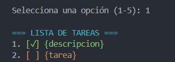
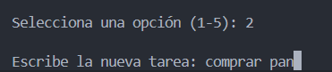
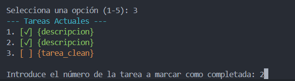
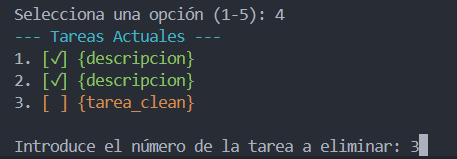
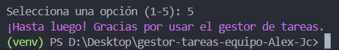

# Gestor de Tareas

Este es un proyecto simple de línea de comandos escrito en Python para gestionar una lista de tareas pendientes. Permite a los usuarios ver, añadir, marcar como completada y eliminar tareas.

## 🌟 Características

* **Ver tareas:** Muestra todas las tareas, indicando cuáles están completadas.
* **Añadir tarea:** Permite ingresar nuevas tareas a la lista.
* **Marcar como completada:** Cambia el estado de una tarea a completada.
* **Eliminar tarea:** Borra una tarea de la lista.
* **Uso de colores:** Utiliza la librería `colorama` para mejorar la legibilidad y la experiencia del usuario.

## Requisitos Previos

Antes de ejecutar el programa, asegúrate de tener instalado:

* **Python 3.13.9**

## ⚙️ Instalación

### 1. Clonar el Repositorio (Si aplica)

git clone [https://github.com/AlejandroHernanCid/gestor-tareas-equipo-Alex-Jc]
cd gestor-tareas-equipo-Alex-Jc 

### 2. Instalar Dependencias

El proyecto requiere la librería `colorama`. Instálala usando `pip` y el archivo `requirements.txt`:

pip install -r requirements.txt

#Instrucciones de uso

    Ejecuta el archivo python main.py,
    una vez iniciado nos saldra el siguiente menu:

        === MENÚ GESTOR DE TAREAS ===
1. Ver tareas
2. Añadir tarea
3. Marcar tarea como completada
4. Eliminar tarea
5. Salir

Selecciona una opción (1-5):

Capturas de ejemplo de cada opción del menú:

1:

2:

3:

4:

5:

Nombre integrantes:

    Alumno A: [Alejandro Hernán Cid]

    Alumno B: [Juan Carlos Perez Simarro]

